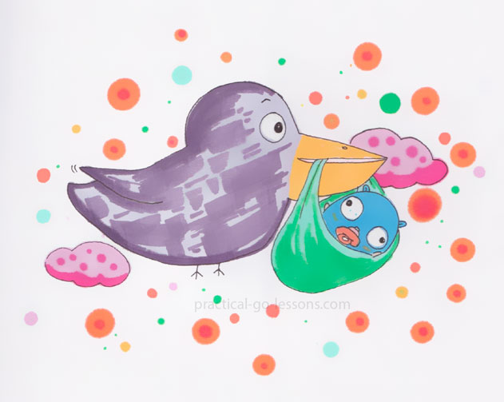

# 第 2 章 - Go 语言

## 1 你将在本章学到什么？

* Go 的起源：它是什么时候创建的，由谁创建。
* 创建 Go 背后的动机。
* Go 语言的主要特征是什么？

## 2 涵盖的技术概念

* 构建时间
* 静态类型语言
* 并发
* 垃圾回收
* 软件依赖

## 3 创造的神话

关于 Go 的创建有一个神话。该语言诞生于 Google 的办公室内，它发生在耗时 45 分钟的漫长构建过程中。

这个故事由 Rob Pike 在 [[@go-at-google]][1] 中讲述。它为我们提供了关于创建 Go 背后动机的宝贵信息。构建时间太长而且痛苦...。他们必须想办法避开它们；那是 Go 起源的切入点。

Robert Griesemer、Ken Thompson 和 Rob Pike 是 2007 年开始从事 Go 的开发人员。Rob Pike 声称，到 2008 年年中，该语言“基本设计完毕，并且实现（编译器、运行时）开始工作。”。之后，Ian Lance Taylor 和 Russ Cox 于 2008 年加入团队 [[@pike2009go]][2]。

Go 是一种由其社区维护的开源编程语言，其核心开发团队人员在 Google 工作。2011 年 3 月 16 日是 Go 首次发布的日期。它被命名为 “r56”。Go 版本 1 于 2012 年 3 月 28 日发布。

## 4 动机

Go（或 Golang）是由 Google 构建的，用于解决公司的问题。为了更好地理解原因，值得阅读 Rob Pike [[@go-at-google]][1] 的主题演讲。

大型跨国公司的软件面临哪些挑战？

* Google 服务的代码库非常庞大。Google 有数百万行代码。
* 这些代码是用不同语言编写的：C、C++、Java 等。
* 这些应用程序的__构建时间__“已经延长到几分钟，甚至几小时”。
* 某些应用程序部件的更新可能代价高昂。

第一个 Gophers[1](#myfootnote1) 的目标是通过以下方式使开发人员的生活更轻松：

* 大幅减少程序的构建时间。
* 为接触过 C、C++ 或 Java 的年轻开发者设计一种易于学习、阅读和调试的语言。
* 设计一个有效的依赖管理系统。
* 构建一种可以在硬件上生成可很好扩展的软件的语言。

### 4.1 概念的定义

* __构建时间__：编译器生成机器可读的可执行文件所需的时间。
* __静态类型语言__：现在给这个概念下一个准确的定义还为时过早。我们将在接下来的章节中讨论这个术语。
* __依赖__：一个被另一个软件使用的软件。
* __可扩展性__：程序处理越来越多的待执行任务的能力。例如，如果一个网站可以接受越来越多的请求而不会停机或增加加载延迟，则该网站被认为是可扩展的。

## 5 Go 主要特点

Go 的创造者将他们的精力集中在几个关键的设计选择上：

* 编译型语言
* 具有易于理解和学习的语义
* 静态类型
* 具有内置并发性的系统，易于开发人员工作
* 具有强大的依赖管理
* 带垃圾收集器

正如 Rob Pike 所说，主要目标是为开发人员提供一种易于学习的语言，用于“设计大型软件项目”。

### 5.1 概念

* __并发__：当任务可以无序或部分顺序执行时，程序是并发的[2](#concurrency)。
* __垃圾收集器__（通常称为 GC）：当我们构建程序时，我们需要存储数据并从内存中获取数据。内存不是一个无限的资源。因此，开发人员必须确保存储在内存中的未使用的元素不时被销毁。将一些数据放入内存称为分配；反过来的动作，包括从内存中删除数据，称为去分配。垃圾收集器的作用是在内存不再被使用时进行去分配。当语言没有任何垃圾收集器时，开发者必须收集他的垃圾并释放不再使用的内存...... 刚好，Go 有一个垃圾收集器。

## 6 Go 的状态

* 该项目发展非常迅速，现在已经有超过一千名贡献者[3](#contributors)。
* 在撰写本文时（2020 年 1 月 8 日），Go 的最新版本是 1.15.6。
* 组织了许多聚会和会议来联合社区[4](#community)
  - 2018 年共组织了 19 个会议：3 个在美国，16 个在其他国家[5](#countries)
  - 2017 年共举办 13 场会议
* Go 是开发人员想要的：
  - 在 2018、2019 和 2020 年的 Stackoverflow 开发人员调查中，Go 是最受欢迎的三种编程语言 [[@dev-survy-2018]][3] 之一。

## 7 自测

### 7.1 问题

1. Go 语言的诞生日期是什么时候？
2. 并发是什么意思？
3. 平均而言，Go 显示出很长的构建时间？对或错？

### 7.2 答案

1. Go 语言的诞生日期是什么时候？
   2007
2. 并发是什么意思？
   当任务可能同时执行时，程序是并发的。
3. 平均而言，Go 显示出很长的构建时间？对或错？
   错。创建该语言是为了解决这个确切的问题。

## 8 关键要点

* Go 诞生于 2007 年。
* Go 版本 1 于 2012 年发布。
* Go 语言很容易理解。它的语义仍然很简单。
* Go 语言它是静态类型的。
* Go 语言是编译型语言。
* 您可以用 Go 编写并发程序。

## 参考
* [go-at-google] ———. 2012. “Go at Google: Language Design in the Service of Software Engineering.” https://talks.golang.org/2012/splash.article.
* [pike2009go] Pike, Rob. 2009. “The Go Programming Language.” Talk Given at Google’s Tech Talks.
* [go-at-google] ———. 2012. “Go at Google: Language Design in the Service of Software Engineering.” https://talks.golang.org/2012/splash.article.
* [dev-survy-2018] “Stackoverflow Developer Survey 2018.” 2018. https://insights.stackoverflow.com/survey/2018/.

<a name="gophers">1</a>: 这是 Go 程序员的昵称。
<a name="concurrency">2</a>: 我们将在另一章中更深入地探讨这个概念。定义取自：https://en.wikipedia.org/wiki/Concurrency_(computer_science)
<a name="contributors">3</a>: 2019 年 8 月 13 日，Go 项目有 1,349 名贡献者。
<a name="community">4</a>: 请参阅此页面：https://github.com/golang/go/wiki/Conferences
<a name="countries">5</a>: 这些数字是 2019 年 8 月 13 日从网页 https://github.com/golang/go/wiki/Conferences 中提取的。

[1]: https://www.practical-go-lessons.com/chap-2-the-go-language#go-at-google
[2]: https://www.practical-go-lessons.com/chap-2-the-go-language#pike2009go
[3]: https://www.practical-go-lessons.com/chap-2-the-go-language#dev-survy-2018
