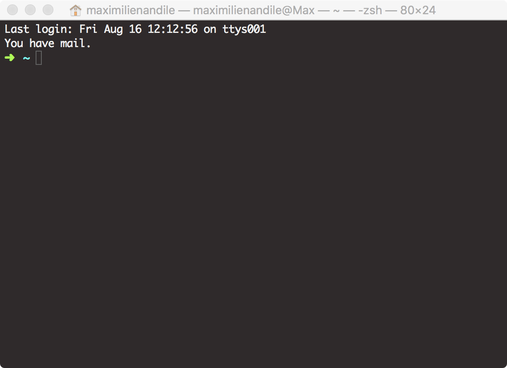

# 第 3 章 - 终端


## 1 您将在本章学到什么？

* 什么是 shell、bash 和终端？
* 如何启动终端应用程序？
* 如何使用 bash 发出基本命令？
* 如何改善您在 Windows 上的“开发人员体验”？

## 2 涵盖的技术概念

* GUI：图形用户界面
* CLI：命令行界面
* Shell
* Bash
* WSL: Linux 的 Windows 子系统

## 3 介绍

Go 程序员的日常生活需要使用终端。本章将解释什么是终端以及如何使用它。如果您已经熟悉它，您可以跳过这一章。

## 4 图形用户界面（GUI）

诸如 macOS、Windows 或 Linux 等操作系统都提供了丰富的图形用户界面 (GUI)。要启动安装在您计算机上的程序，您通常只需要双击桌面上的图标即可。程序将显示在具有交互式界面的窗口中：菜单、侧边栏、按钮...

我们说这些程序提供了图形用户界面 (GUI)。绝大多数用户将使用提供这些接口的程序。图形界面易于使用且直观。

## 5 命令行界面（CLI）

图形用户界面并不总是存在。第一台计算机就没有这样的能力。但是这些计算机的用户是如何设法启动和使用程序的呢？计算机附带了命令行界面。此接口也称为“shell”。shell 是一种可以向操作系统传递命令的程序<sup>1(#shell)</sup>。Shell 是指定此类程序的通用术语。最著名的 shell 是 bash（Bourne Again Shell）。Bash 默认随 macOS 和绝大多数 Linux 发行版一起提供。默认情况下，Windows 也附带一个 shell（但它不是 bash）。

## 6 如何与 shell 交互：终端

在旧计算机上启动后，shell 直接呈现给用户。在现代计算机上，我们必须启动一个程序来与 shell 交互。该程序通常称为终端。我们将看到如何在 MacOS、Linux (GNOME) 和 Windows 打开终端。

### 6.1 macOS

* 打开 **Finder** 应用程序：


* 接着在菜单栏上点击 “Go”，接着选择 “Utilities”。


* 上述步骤将打开一个窗口。点击 “Terminal”。


* 一个新的终端将打开。



请注意，我使用的是自定义终端。因此，您可能会看到不同的输出；这是完全正常的。

### 6.2 Linux（Ubuntu）

* 在 Ubuntu 上，您可以使用快捷键 `Ctrl+Alt+T`。
* 您还可以使用 Ubuntu Dash 启动终端。输入“Terminal”，应用程序就会出现。

### 6.3 Windows

* 单击开始按钮，然后在文本框中键入 “cmd”（用于命令提示符）。


* 接着，点击应用程序 cmd。


* 这时应该会出现一个黑色窗口；这是您的终端！


#### 6.3.1 Cmder

终端和 Windows shell 在今天的基础上不是很实用。我建议您安装 cmder<sup>2(#cmder)</sup> 以使您的开发人员在 Windows 上的生活更轻松。Cmder 是一个模拟器，允许您使用 Linux/MacOS 上可用的命令。安装过程很简单（在 GitHub 上下载最新版本）然后启动安装向导即可。

安装 cmder 后，启动程序 “Cmder” 打开你的全新终端。

### 6.3.2 适用于 Windows 的 Bash

默认情况下，您不能在 Windows 计算机上使用 bash。这不是问题，但这意味着您必须为每个 macOS/Linux 命令找到等效的 Windows 命令。它在某些时候可能很麻烦，因为网络上的许多示例和教程并不总是为 Windows 提供等效性。

Microsoft 宣布您现在可以在您的 Windows 计算机上安装 “Linux 的 Windows 子系统”（WSL）。这是一个好消息，因为您将可以使用 bash。您可以在 Microsoft 网站上找到安装说明：https://docs.microsoft.com/en-us/windows/wsl/install-win10 （适用于 Windows 10）。

我强烈建议你安装这个，因为它将使你的生活更轻松，即使我在接下来的章节中试图给 Windows 的基本命令提供等价命令。

## 7 如何使用终端

打开终端后，您将看到一个黑色窗口。这是您可以输入命令的界面。这不直观，因为要输入命令；您必须先了解它们！每个命令都有一个名称。要启动命令，您将输入其名称，最后输入一些选项，然后按 Enter。让我们来看个例子。

### 7.1 关于美元符号

在示例中，您将看到一条以美元符号开头的行。这是一个约定；它的意思是“将它输入到你的终端中”，当您想重现这些例子时，**不要输入美元**，只输入美元之后的所有内容。

### 7.2 MacOS/Linux

假设我们要列出桌面的内容。输入以下命令（用您的名字替换 `maximilienandile`）。

* MacOS

```
$ ls /Users/maximilienandile/Desktop
```

* Linux

```
$ ls /home/maximilienandile/Desktop
```

然后按回车。您将看到一个文件和目录列表。

现在输入以下命令：

```
$ pwd
```

按回车键。结果如下：

```
/Users/maximilienandile
```

这里我们使用了两个命令：

* **ls**：允许您列出目录的内容。
* **pwd**：允许您打印工作目录，（打印您所在目录的名称）。

### 7.3 Windows（不带 Linux 子系统的 Windows）

列出当前目录内容的命令是 `dir`：


每行将代表一个文件或一个目录。如果是目录，第三列有 “<DIR>”。如果它是文件，则什么都没有。

### 7.4 Windows（带有 WSL 和 Cmder）

如果您已经安装了 **WSL** 和 **cmder**，第一步是启动 cmder（例如，通过 Windows 菜单）。然后您可以通过键入以下命令来启动 **bash**：

```
$ bash
```

然后按回车。现在您正在使用 bash！（恭喜）。要列出主目录中的元素，只需输入：

```
$ ls /mnt/c/Users/maxou123
```

（其中 `maxou123` 是您的用户名）。

## 8 自测

### 8.1 问题

1. 列出目录内容的命令是什么？
2. 什么是终端？
3. 给出一个众所周知的 shell 的名称。

### 8.2 答案

1. 列出目录内容的命令是什么？
   1. `ls` - 类 Unix 系统
   2. `dir` - Windows 系统
2. 什么是终端？
   1. 终端是一个程序，它提供了一个使用 shell 的接口。
3. 给出一个众所周知的 shell 的名称。
   1. Bash。

## 关键要点

* 图形用户界面并不总是存在。
* 为了与计算机交互，我们可以使用图形界面或命令行界面。（CLI）
* 要使用 CLI，我们必须打开一个终端应用程序，该应用程序提供与 shell 交互的接口。
* Bash 是一个 shell。
* 您可以通过输入入命令名称和最终选项来启动命令，然后按 Enter。
* 我们将使用终端来启动特定于 go 的命令。

## 译者著

* 本章原文将“涵盖的技术概念”放在了 1.1 节，但是结合前两章来看，放在第 2 节更为合适，因此翻译时将其放在了第 2 节。

<hr>

* <a name="shell">1</a>: http://www.catb.org/jargon/html/S/shell.html
* <a name="cmder">2</a>: https://cmder.net/ , github repository : https://github.com/cmderdev/cmder
