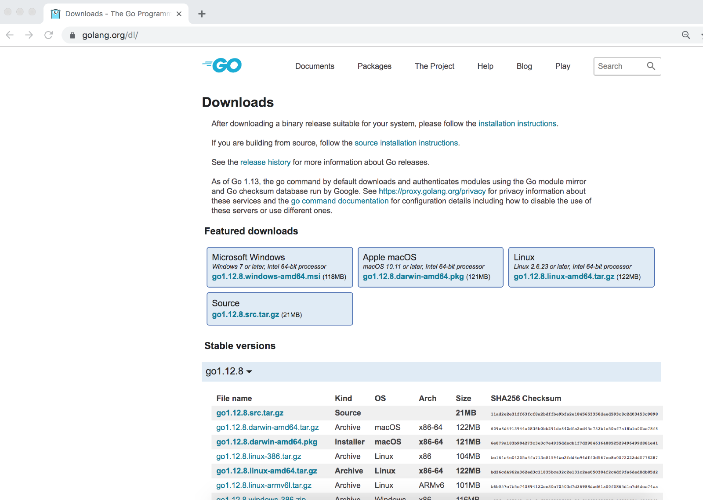
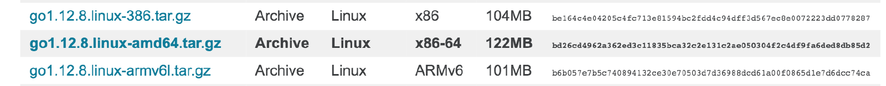
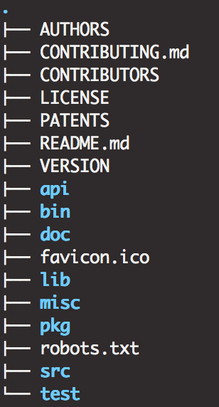
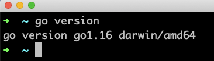
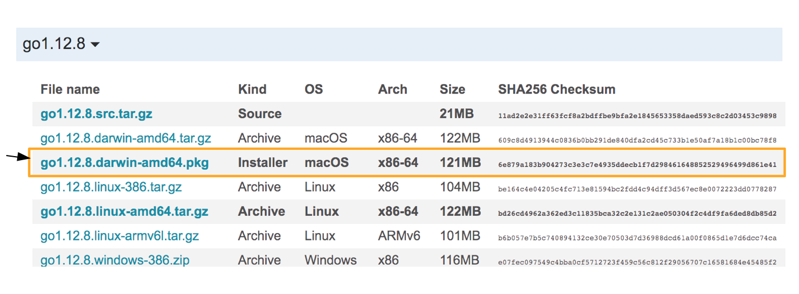
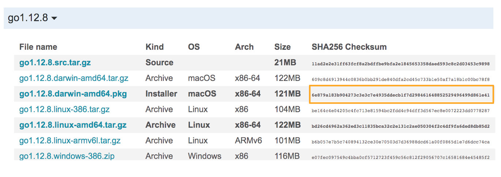
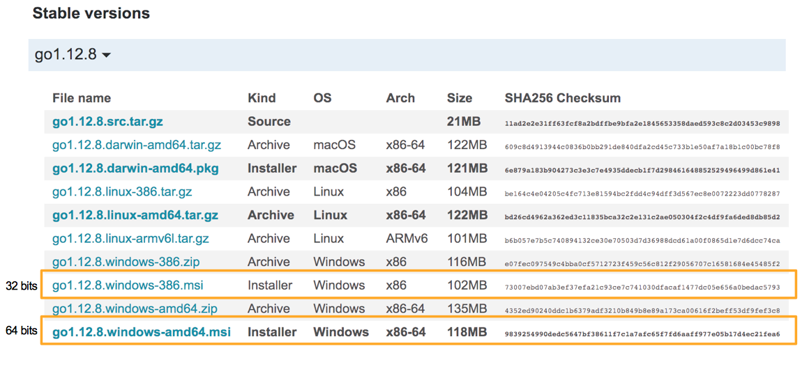

# 第 4 章 - 搭建开发环境


## 1 您将在本章学到什么？

* 如何在您的电脑上安装 Go。
* 如何计算校验和 (SHA 256)。

## 2 涵盖的技术概念

* 计算机架构
* Hash 函数
* 压缩/解压
* Shell 配置文件
* PATH 环境变量

## 3 介绍

要编写 Go 程序，您需要一个编辑器。为了测试、记录、编译、格式化你的 Go 程序，你需要安装 Go 工具链。

本章将指导您完成安装过程。

## 4 计算机架构

在下文中，您将需要了解您的**计算机体系结构**。这个技术术语有时会给新手带来困惑。究竟是什么？

计算机有不同的形状、价格和形式。许多消费者关注计算机的品牌及其高级规格（如 RAM、硬盘驱动器的存储量）。处理器的问题有时被市场营销所回避，但它是计算机的一个基本部分。处理器也称为 CPU（*C*entral *P*rocessing *U*nit）<sup>译 1(#CPU)</sup>。

CPU 负责运行系统指令和程序。CPU 是一个通用术语。有不同类型的 CPU 可用。

程序使用一组预定义指令与机器对话。我们将这个命令列表称为指令集。一些处理器共享相同的指令集。其他的则有完全不同的指令集。架构的概念包括指令集、物理组织以及计算机实现。

您现在明白了为什么这个概念在机器级别上是必不可少的。Go 工具链是一个程序的集合，我们将用它来构建我们的程序。

* 这些程序是用 Go 编写并编译的。
* Go 团队为每个支持的操作系统和架构提供不同版本的工具链。
  - Go 有最低系统和操作系统要求。
  - 您可以在此网页上查看它们：
    - https://github.com/golang/go/wiki/MinimumRequirements
	- 该页面经常更新。

## 5 Go 工具链安装

要开始开发 Go 程序，您必须首先在您的计算机上安装 Go。要安装它，您必须下载一个文件。根据您的操作系统，安装过程略有不同。只需按照与您的操作系统相对应的步骤操作即可。

第一步（不依赖于你的操作系统）是去官方下载页面：https://golang.org/dl/ 。顺便说一下，golang.org 是 Go 的官方网站。我们强烈建议您仅从此 URL 下载 Go。



在本节中，我们将介绍 Linux、macOS 和 Windows 系统下 Go 的安装。请注意，Go 也可用于 FreeBSD。

### 5.1 Linux

#### 5.1.1 确定您的架构

您必须首先确定计算机的体系结构，从而帮助您选择要下载的正确文件。

打开终端并输入以下命令：

```shell
$ uname -p
```

`uname` 是一个显示系统特征的程序。选项 `-p` 将显示“处理器架构名称”。

Golang Linux 版本提供了以下架构的安装程序：

* x86
* x86-64
* ARMv6
* ARMv8
* ppc64le
* s390x

#### 5.1.2 下载安装包

当你知道你的架构后，你现在可以在 Go 网站上下载相应的压缩文件夹：



只需单击蓝色链接，即可开始下载。

接下来，我们将为 x86-64 架构安装 1.12.8 版本。其他架构和版本的说明相同。只有安装包的名称会改变。

#### 5.1.3 检查安装包的哈希

强烈建议执行此步骤。目的是检查您的安装包是否。为此，请打开终端并键入：

```shell
$ cd /where/you/have/downloaded/the/file
$ sha256sum go1.12.8.linux-amd64.tar.gz
```

第一个命令使用 `cd`（change directory，更换目录）转到您下载的文件所在的目录。例如，如果文件在 `/home/max/` 你必须执行：

```shell
$ cd /home/max
```

下一个命令将计算文件 `go1.12.8.linux-amd64.tar.gz` 的 **SHA256** 哈希（这是一个加密哈希函数）。

**加密哈希函数**：一个将可变大小数据（文件、单词、句子）作为输入并输出固定大小数据的函数。通过输出几乎不可能猜测出函数的输入。该函数的结果称为“散列”或“消息摘要”。在这里，我们使用它来确保文件下载到我们的计算机后没有被更改。为此，我们将在计算机上计算的哈希值与 Go 网站上提供的哈希值进行比较。如果两者相等，则没有改变。

执行 `sha256sum` 后，您将在屏幕上看到一组字符，您必须将这些字符与网站上显示的哈希值进行比较。如果不相同，则出现了问题，请勿使用下载的文件。如果您计算的哈希值与 Go 网站上显示的哈希值相等，那么您就可以开始安装了。

#### 5.1.4 解压安装包

存档是 gzip 压缩的（用 `gzip` 压缩，通常称为 tarball）。要解压，您有两个选择：

1. 使用图形界面（如果有的话）：双击安装波，将打开一个窗口。按照说明操作。您需要将其解压到 `/usr/local` 目录下。
2. 使用终端。

我们采用第 2 种方式。

打开你的终端并输入命令：

```shell
$ sudo tar -C /usr/local -xzf go1.12.8.linux-amd64.tar.gz
```

我们将使用 `tar` 应用程序（在 sudo 模式下）。

* **-C /usr/local**：意味着我们将执行目录更改为 **/usr/local**。
* **-xzf go1.12.8.linux-amd64.tar.gz**：意味着我们要提取 (x) 使用 gzip 压缩的 `go1.12.8.linux-amd64.tar.gz` 安装包。

#### 5.1.5 设置 PATH 环境变量

让我们看一下文件夹 `/usr/local/go` 的树视图：



我们有八个文件夹：`API`、`bin`、`doc`、`lib`、`misc`、`pkg`、`src` 和 `tests`。

文件夹 `bin` 包含三个<sup>译 2(#bin)</sup>可执行文件：

* **go**：这是主要的可执行文件。
* **godoc**：这是一个用于生成文档的程序<sup>1(#godoc)</sup>。
* **gofmt**：这个程序将根据语言约定格式化您的源文件。

如果您进入 `bin` 目录，则可以启动 go。试试这个命令：

```shell
$ ./go version
```

它将打印 go 的版本。但这并不令人满意。我们希望能够打开终端并在任何地方运行 `go version`<sup>译 3(#go-version)</sup>。为此，我们需要将此文件夹添加到 `PATH` 环境变量中。

**PATH**：一个名为 `PATH` 的环境变量，它包含一个目录列表，当用户发出命令时，shell 会在其中搜索可执行文件。你会经常听到"把这个目录添加到 `PATH` 中"。这种表达方式意味着你必须将一个目录地址追加到 `PATH` 环境变量中。

以下命令将 “/usr/local/go/bin” 附加到 `PATH` 环境变量：

```shell
$ export PATH=$PATH:/usr/local/go/bin
```

我们用已经包含在 `PATH` 中的值（用 `$PATH` 表示）来设置变量 `PATH`（用 `export` 命令），并在它后面加上字符 ":/usr/local/go/bin"。如果您在同一个终端输入：

```shell
$ go version
```

您将看到显示的 Go 版本。



##### 修改 shell 配置文件

现在，如果您关闭终端并打开另一个终端，您会发现它不再起作用。环境变量 `PATH` 仅针对您的当前会话进行了修改。当您打开一个新终端时，您将创建一个新会话。对 `PATH` 的修改不会传播到新的会话<sup>译 4(#path)</sup>。

要为每个新会话修改 `PATH` 变量，您必须更改您的 shell 配置文件。您需要在配置文件的开头添加 “export PATH=$PATH:/usr/local/go/bin”。

* 如果使用 bash 修改的文件是 `~/.bashrc`。它在会话开始时运行。
* 如果使用 zsh，修改的文件是 `~/.zshrc`。它在会话开始时运行。
* 对于其他 shell，请参阅提供的文档，但它的工作方式应该相同。

修改 `.bashrc` 或 `.zshrc` 后，不会立即应用更改。您需要开始一个新会话才能看到结果。

如果你不想开始一个新的会话，你可以输入这个命令并按回车：

```shell
$ source ~/.bashrc
```

##### 测试安装

打开终端并询问 Go 的当前安装版本：

```
$ go version
```

应该会出现版本号！

### 5.2 macOS

在 macOS 上安装 go， 有两个主要选项：

1. 使用安装程序。
2. 下载二进制文件并自行安装。

第三种选择是从源代码编译。为简单起见，我们将向您展示如何使用安装程序。

#### 5.2.1 下载安装程序

转到网站 https://golang.org/dl/ 并下载适合您所需版本的安装程序。在下图中，我们突出显示了与 macOS 安装程序版本 1.12.8 对应的行。



#### 5.2.2 检查安装程序的哈希

为了验证下载文件的完整性，我们将计算 SHA256 加密哈希。为此，请打开一个终端窗口。然后输入命令：

```shell
$ cd Downloads
$ shasum -a 256 go1.12.8.darwin-amd64.pkg    SHA_SUM  go1.12.8.darwin-amd64.pkg
```

第一个命令会将当前目录 (`cd`) 更改为 `/Downloads`。然后我们将使用工具 **shasum**。我们添加选项 `-a` 表示我们要使用 SHA256 哈希函数。结果将由加密哈希和散列文件的名称组成。

要验证哈希，请转到下载页面并检查 SHA256 校验和列。您需要验证您获得的哈希值与 Go 团队给出的哈希值是否相同。

将 **SHA_SUM** 替换为您在网下载文件的哈希值。

在下图中，您可以看到哈希之间的相等性。



#### 5.2.3 启动安装程序

双击下载的文件。它将自动启动安装向导。按照安装过程进行。在安装过程中，您会被要求提供您的密码。安装程序将把运行 Go 所需的文件放到 **/usr/local/go** 目录中。

##### 修改 shell 配置文件

打开终端并输入：

```shell
$ go version
```

如果显示了 go 的版本，那么您就可以开始了！否则，您需要将 Go 添加到您的 `PATH` 环境变量中。

您可以按照上一节中的说明进行操作。它们对于 macOS 是相同的。

## 5.3 Windows

在本节中，我们将向您展示如何使用 **.msi** 安装程序安装 go。这是最简单的方法。但首先，请看一下 Windows 操作系统的具体要求：https://github.com/golang/go/wiki/MinimumRequirements#windows 。

#### 5.3.1 确定您的架构

Go 对于 Windows 有于两种架构：

* x86，对应于 32 位系统
* x86-64，对应于 64 位系统

要知道您的系统是 32 位还是 64 位，您必须检查系统属性：

* 对于 Windows 7
  - 点击开始按钮
  - 右键单击**计算机**
  - 然后点击**属性**
  - 一个窗口将显示**系统类型**

* 对于 Windows 10 和 Windows 8.1
  - 点击**开始**按钮
  - 然后转到**设置**，然后是**系统**和**关于**
  - 一个窗口将显示**系统类型**

#### 5.3.2 下载安装器

现在您已经了解了自己的架构，您可以在 Go 官方网站上下载相应的安装程序：



#### 5.3.2 检查安装程序哈希

下载正确的安装程序后，您必须检查其完整性。为此，我们将计算下载文件的 SHA256 哈希值。

Windows 有一个名为 **certutil.exe** 的内置程序。该程序是“证书服务”的一部分。该程序位于 **C:\Windows\System32\certutil.exe**。如果找不到，建议您在 Windows 文件夹中进行搜索。

要计算 SHA256 哈希，请打开一个终端，然后键入以下命令。

```shell
$ cd C:\users\max\downloads
$ certutil -hashfile go1.12.8.windows-amd64.msi SHA256
SHA256 hash of file go1.12.8.windows-amd64.msi:
98 39 25 49 90 de dc 56 47 bf 38 61 1f 7c 1a 7a fc 65 f7 fd 6a af f9 77 e0 5b 17 d4 ec 21 fe a6
CertUtil: -hash file command completed successfully.
```

然后，您必须将 certutil 计算的哈希值与 golang.org 网站上显示的哈希值进行比较。 certutil 输出的字符串在每个十六进制数之间都有空格。您必须复制字符串并删除空格。

如果两个字符串相等，则可以进行下一步。如果没有，您会得到一个损坏的版本。不要使用它。

#### 5.3.4 启动安装程序

双击安装程序并按照说明进行操作。在安装过程结束时，测试您的安装。打开终端并输入以下命令：

```shell
$ go version
```

如果您看到打印的版本，则您已完成安装。

## 6 Go 环境变量

Go 使用环境变量进行配置。在本节中，我们将详细介绍其中的一些：

* `GOBIN`：默认情况下，Go 会将编译后的程序放入 `$GOPATH/bin`。如果要覆盖此行为，可以设置此变量。
* `GOROOT`：Go 发行版安装的绝对路径（对于 Linux 和 macOS 用户，默认为 **/usr/local/go**）。
* `GOHOSTOS`：这是 Go 工具链的操作系统。
* `GOHOSTARCH`：这是 Go 工具链二进制文件的系统架构。

要打印所有 Go 环境变量，您可以使用以下命令：

```shell
$ go env
```

当您的 Go 设置有问题时，请使用此命令。这是命令的输出：

```shell
GO111MODULE=""
GOARCH="amd64"
GOBIN=""
GOCACHE="/Users/maximilienandile/Library/Caches/go-build"
GOENV="/Users/maximilienandile/Library/Application Support/go/env"
GOEXE=""
GOFLAGS=""
GOHOSTARCH="amd64"
GOHOSTOS="darwin"
GOINSECURE=""
GOMODCACHE="/Users/maximilienandile/go/pkg/mod"
GONOPROXY=""
GONOSUMDB=""
GOOS="darwin"
GOPATH="/Users/maximilienandile/go"
GOPRIVATE=""
GOPROXY="https://proxy.golang.org,direct"
GOROOT="/usr/local/go"
GOSUMDB="sum.golang.org"
GOTMPDIR=""
GOTOOLDIR="/usr/local/go/pkg/tool/darwin_amd64"
GOVCS=""
GOVERSION="go1.16"
GCCGO="gccgo"
AR="ar"
CC="clang"
CXX="clang++"
CGO_ENABLED="1"
GOMOD="/dev/null"
CGO_CFLAGS="-g -O2"
CGO_CPPFLAGS=""
CGO_CXXFLAGS="-g -O2"
CGO_FFLAGS="-g -O2"
CGO_LDFLAGS="-g -O2"
PKG_CONFIG="pkg-config"
GOGCCFLAGS="-fPIC -arch x86_64 -m64 -pthread -fno-caret-diagnostics -Qunused-arguments -fmessage-length=0 -fdebug-prefix-map=/var/folders/lm/9l2tk4811x32rmw4407f9h3m0000gn/T/go-build744222834=/tmp/go-build -gno-record-gcc-switches -fno-common"
```

## 7 常见错误

在本节中，您可以找到 Go 安装过程中遇到的常见问题列表。

### 7.1 当我想启动 go 二进制文件时出现“找不到命令”或“无法识别”错误

#### 7.1.1 症状

使用 zsh shell（在 Linux 或 Mac 上）时：

```shell
$ go version
zsh: command not found: go
```

使用 bash shell（在 Linux 或 Mac 上）时：

```shell
$ go version
bash: command not found: go
```

对于 Windows：

```shell
$ go version
'go' is not recognized as an internal or external command, operable program Or batch file.
```

#### 7.1.2 说明

这个错误信息意味着你的 shell 没有找到 "go" 可执行文件。当你打开一个终端时，shell 会加载环境变量 `PATH`（见上一节的定义）。这个变量包含文件系统中的目录地址列表。shell 将在这些目录中寻找是否有名为 "go" 的可执行文件。如果找不到名为 "go" 的可执行文件，它将输出一个错误。

#### 7.1.3 解决方案

* 验证包含 “go” 二进制文件 (go/bin) 的文件夹是否已添加到您的 `PATH`。
  - 对于 Linux 和 Mac 用户：
    - 打开终端并输入 “echo $PATH”
	- 检查目录 go/bin 是否在输出结果中
	  - `$ echo $PATH`
	    /usr/bin:/bin:/usr/sbin:/sbin:/usr/local/go/bin
	  - 在这里可以看到 **/usr/local/go/bin** 在 `PATH` 中
	  - 如果 **/usr/local/go/bin** 不在 `PATH` 中（按照上一节中提供的说明进行操作）
  - 对于 Windows 用户：
    - C:> echo %PATH% C:;C:;C:
	- 这里设置是正确的。 bin 文件夹在 `PATH` 中
	- 如果不是，请将其添加到 `PATH`。这样做：
	  - 打开**系统** > **高级系统设置**
	  - 然后单击按钮**环境变量**。应出现一个包含所有环境变量的窗口
	  - 点击 “PATH”
	  - 添加分号，然后添加 “C:\Go\bin”
	  - 关闭终端窗口并打开另一个窗口。应该就可以工作了
* 如果之前的解决方案不起作用，您应该检查 “go” 二进制文件是否有效存在于您认为的位置。
  - 对于 Linux 和 Mac 用户：
    - 转到 **/usr/local/go/bin** 并确认您有一个名为 “go” 的文件
  - 对于 Windows 用户：
    - 转到 **C:\Go\bin** 并确认您有一个名为 “go” 的文件
  - 例如，当文件夹 Go（或 go）甚至不存在时，您将需要重新安装它。也许您将安装的二进制文件放入另一个目录？

### 7.2 错误“执行格式错误”

#### 7.1.1 症状

Go 二进制文件可以在您的系统中找到，但是当您启动 Go 命令时，您会收到错误消息：

```shell
$ go version
zsh: exec format error: go
```

#### 7.1.2 说明

您可能下载了不符合您系统的版本。例如，您下载 Linux 的二进制文件并在您的 Mac 上启动它。

#### 7.1.3 解决方案

下载与您的操作系统和计算机架构相对应的版本。

## 8 自测

### 8.1 问题

1. 如何输出 Go 的版本号？
2. 在哪里可以找到最新版本的 Go？

### 8.2 答案

1. 如何输出 Go 的版本号？
   1. 打开终端
   2. 输入 `go version`
2. 在哪里可以找到最新版本的 Go？
   1. Go 的最新版本可在 Go 官方网站上获得：https://golang.org/dl/

## 9 关键要点

* Go 工具链可在 Go 官网获取。
* Go 工具链可用于 Windows、macOS 和 Linux 操作系统。
* 您应该下载与您的操作系统和架构相匹配的版本。
* 安装 Go 工具链后，您可以使用您喜欢的终端启动 **go** 命令。
  - 您可能需要将 go 二进制文件添加到 `PATH` 环境变量中。

<hr>

* <a name="godoc">1</a>: 在最新版本中，`godoc` 已从 `bin` 目录中删除。
* <a name="CPU">译 1</a>：原文是 `Central Pprocessing Unit`，应该是笔误多写了一个 `p`。
* <a name="bin">译 2</a>：原文是 `two executables`，而从下面的内容来看应该是三个可执行文件。
* <a name="go-version">译 3</a>：原文是 `go -version`，实际上应该是 `go version`。
* <a name="path">译 4</a>：原文说是会传播到新的会话，实际上是不会传播到新的会话，此处应是笔误。
