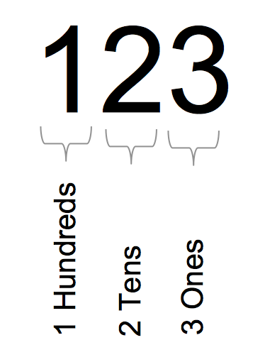
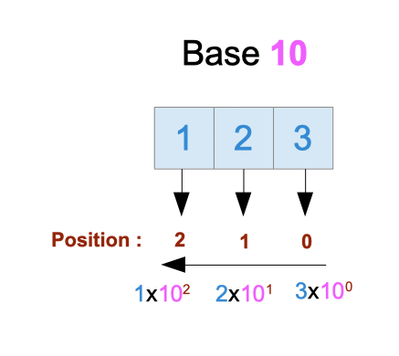

# 第 6 章 - 二进制和十进制

## 1 您将在本章学到什么？

* 十进制和二进制计数系统之间的区别。
* 计算机如何存储数据。
* 32 位和 64 位系统有什么区别？

## 2 涵盖的技术概念

* 二进制（binary）
* 位（bits），字节（bytes）
* 十进制（decimal）
* 编码（encoding），编码器（encoder）
* RAM

## 3 简介：数值、数字和数量

首先，让我们定义一些重要的术语。

* **数值（numeral）**：代表数字的符号或字符组[1](#numeral)。
* **数字（number）**：一个数字代表一个数量，是我们可以计算的东西。
* **数值**是一个**数字**的代表。
* **数值系统（numeration system）**：数值系统是一套规则，使我们能够计算事物和表示数量。

我们每天都在使用十进制表示的数字：10.254 , 125, 2020, 31 ....

但**十进制系统并不是唯一的系统**，也不是一直在使用。

我们可以使用其他计数系统来表示数字。

* 我们以数量 “123”[译1](#译1) 为例
  - 在十进制系统表示为 “123”
    - 数值值为 “123”
  - 在二进制系统中表示为 “1111011”
    - 数值值为 “1111011”
  - 在十六进制系统中表示为 “7B”
    - 数值值为 “7B”
  - 在八进制系统中表示为 “173”
    - 数值值为 “173”

同一个量，相同的意义可以有不同的表现形式。

为什么理解这一点很重要？因为计算机不会使用十进制系统存储数据。在物理层面，信息使用零和一存储。

本章将详细介绍十进制和二进制是如何工作的。

## 4 词源和符号

十进制来自拉丁语 “Decimus”，意思是“第十”。而二进制来自拉丁语 “bini”，意思是“两个在一起”。这两个词的词源为我们提供了有关如何构建这些系统的提示：

* 二进制系统使用两个符号 0 和 1。
* 十进制系统使用十个符号，分别是 0、1、2、3、4、5、6、7、8、9。

使用二进制写入的数据将使用 0 和 1 写入。例如，101010 是使用二进制编码系统编写的。

使用十进制写入的数据将使用 0、1、2、3、4、5、6、7、8、9 写入。例如，使用十进制写入 42。数字 10 可以使用二进制系统或十进制系统进行编码（因此，它不会代表相同的基础数量）。

## 5 十进制系统

我们来看一个用十进制写的数字：123。

这个数字是一百二十三。这个数字由“数字（digits）”组成。第一个数字代表百的数量。第二个数字是十位数。最后一位是个位数。十进制系统是有位置的。这意味着一个数字对数字的贡献取决于该数字在数字中的位置。

让我们更进一步。我们可以用数字十来写数字一百：

100 = 10 × 10

我们可以使用十的幂：

10 × 10 = 102

102 等价于 10 × 10。我们将 10 视为基数，而 2 视为指数。当我们读它的时候，我们说它是 10 的 2 幂。根据这种规则，我们可以按如下方式表示：

10 = 101

和

1 = 100

最后一个可能看起来很奇怪。这是一条数学规则：任何数的 0 次幂都等于 1。

有了上面的基础，我们可将数字 123 分解成 10 的幂来计数：

123 = 1 × 102 + 2 × 101 + 3 × 100

如果您从左到右依次读取 1 × 102 + 2 × 101 + 3 × 100，您会发现 10 的幂依次递减。

这个次幂数往往与数字写下时的位置相对应。

* 数字 “1” 在位置 2 处（1 × 102）
* 数字 “2” 在位置 1 处（2 × 101）
* 数字 “3” 在位置 0 处（3 × 100）

我计算位置的方式可能会让您感到惊讶。您预计可能是这样的：

* 数字 “1” 在位置 3
* 数字 “2” 在位置 2
* 数字 “3” 在位置 1

如果您从 1 开始计数，这是完全正确的，但我们从零开始计数。记住这个约定，因为它以后会对您有所帮助！

总之，数值与数字的关系如下。

对于给定的数字：

digit2digit1digit0

对应的数字（数量）为：

digit2 × 102 + digit1 × 101 + digit0 × 100

当然，这种关系对多于（或少于）三位数的数字仍然有效！

### 5.1 小数

我们已经看到系统如何处理整数数字；小数呢（带有“小数分隔符”的数字，比如 123.14）

它们同样与 10 的幂有关联。

$ 123.45 = 1 \times 10^{2} + 2 \times 10^{1} + 3 \times 10^{0} + 4 \times \frac{1}{10^{1}} + 5 \times \frac{1}{10^{2}} $

这是有道理的，因为：$ \frac{1}{10^{1}} = \frac{1}{10} = 0.1 $，因此 $ 4 \times \frac{1}{10^{1}} = 0.4 $

$ \frac{1}{10^{2}} = \frac{1}{100} = 0.01 $，因此 $ 5 \times \frac{1}{10^{2}} = 0.05 $

* <a name="numeral">1</a>：https://www.encyclopedia.com/social-sciences-and-law/economics-business-and-labor/businesses-and-occupations/numeration-systems
* <a name="译1">译1</a>：此处原文为 “one hundred two thousand and three”，实际上应该是 “123”。

