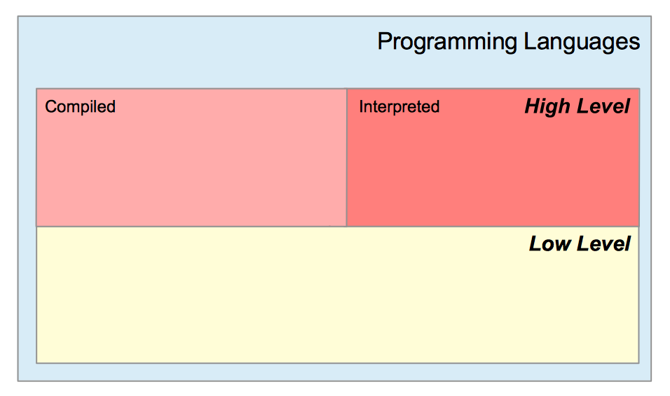
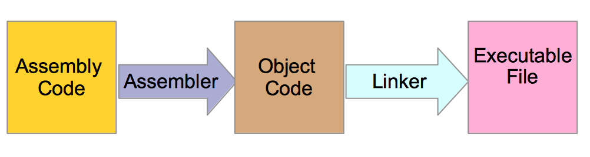
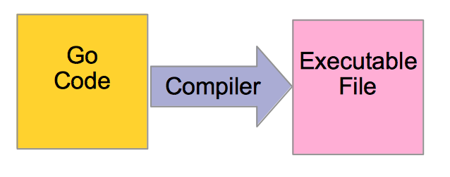

# 第 1 章 - 计算机编程


## 1 您将在本章学到什么？

* 我们将列出计算机的不同硬件部分。
* 我们将了解什么是程序以及它的样子。
* 我们将了解程序是如何加载并执行的。

## 2 涵盖的技术概念

* 存储器、算术和逻辑运算器，输入输出设备，控制器
* 中央存储器、辅助存储器
* 易失性和非易失性内存
* RAM/ROM
* CPU
* 高级语言和低级语言
* 汇编语言、汇编器
* 编译性语言和解释性语言

## 3 介绍

这是一本关于 Go 语言的书。在我们进入主题之前，您需要了解一些有关计算机的基本知识。

有经验的程序员可以跳过本章阅读后面的章节。初学者应该花一些时间来研究这些内容。

您的程序将在硬件上运行。了解您的硬件如何工作可能会有助于您改进您的程序设计。

首先，我们将介绍计算机的主要组件。然后我们将了解什么是程序以及机器如何处理它。

## 4 四大硬件组件

计算机由四个主要部分组成：

* **存储器 (memory unit, MU)** 用于存储数据和程序。
  - 例如，我们可以将大学班级的成绩存储到存储器中。我们还可以存储是一个程序来计算班级的平均成绩。
* **运算器 (arithmetic and logic unit, ALU)** 它的作用是对存储在存储器中的数据进行算术和逻辑运算。运算器可以执行加法、递增、递减这些操作。通常，每个操作需要两个操作数并产生一个结果。
  - 假设我们要执行 `5 + 4`。这两个数被成为操作数。该操作的结果是 `9`。操作数来自于存储器。ALU 是一种设计用于执行操作的电路。
* **输入/输出 (input and output unit, I/OU)** 负责将数据从输入设备加载到存储器中。它同时还将数据存储存储器发送到输出设备。
  - 计算机的触摸板、键盘、鼠标都属于输入设备。
  - 您的显示器就是输出设备。
* **控制器 (control unit, CU)** 将接收来自程序的指令，并控制其它单元的活动。

这四个组件代表了计算机组件的示意图。

## 5 存储

计算机由两种类型的存储组成：

* 中央存储器
* 辅助存储器

存在两类存储：

* 易失性
* 非易失性

### 5.1 中央存储器

这种类型的存储是运行操作系统和计算机将运行的所有程序所必须的。中央存储器包含两种类型的存储：

* **RAM**（随机存取存储器）。这种类型的存储需要电力来保存数据。当您关闭计算机时，此类存储中包含的内存将被删除。您使用的操作系统和程序将加载到此内存中。这种类型的内存是**易失性的**。
* **ROM**（只读存储器）。这是一个内存中包含了计算机正常运行所需的数据。这种内存是**非易失性的**（当您关闭计算机时，它不会被擦除）。它被设计为只读并且系统不能对其进行更新。

### 5.2 辅助存储器

这种类型的存储是非易失性的。断电时，存储的数据不会被删除。以下是辅助存储器的一些示例：硬盘驱动器、USB 密钥、CD-ROM、DVD 等等。

与 RAM 相比，对此类内存的读取和写入速度较**慢**。

一些硬盘驱动器顺序访问内存。系统应该遵守特定的顺序。遵守此访问顺序比随机访问模式需要更长的时间。请注意，某些硬盘驱动器允许随机内存访问。

#### 5.2.1 SSD 固态硬盘

硬盘驱动器，即 HHD，由旋转的磁盘组成。通过移动磁头读取和写入数据。读取和写入会产生旋转和磁头移动，这会消耗时间。

## 6 CPU

CPU 是 **中央处理器（Central Processing Unit）** 的缩写。CPU 也表示**处理器（Processor）**。CPU 包含：

* **算术逻辑单元（ALU）**
* **控制器（CU）**

CPU 将负责执行程序给出的指令。例如，程序可以指示在两个数字之间执行加法。这些数字将从内存单元中取得并传递给 ALU。该程序可能还需要执行 I/O 操作，例如从硬盘驱动器读取数据并将其加载到 RAM 中以供进一步处理。PU 将执行这些指令。

CPU 是计算机的核心部件。

## 7 什么是程序？

为了让计算机做某事，我们必须向它们提供精确的指令。这组指令称为“程序”。

程序的正式定义是“使计算机硬件能够进行计算的计算机指令和数据定义的组合”[[@institute1990ieee]](https://www.practical-go-lessons.com/chap-1-programming-a-computer#institute1990ieee)。

让我们来看一个例子。想象一个要求用户输入两个数字的程序。程序将这些数字相加，然后将结果显示在显示器上。我们必须提供以下说明：

1. 在显示器上输出“请输入您的第一个数字并按回车键”。
2. 当输入一个数字并按下键盘上的 “Enter” 键时，将数字存储到内存中。让我们用 *A* 表示这个数字。
3. 在显示器上输出“请输入您的第二个数字并按回车”。
4. 当输入一个数字并按下键盘上的 “Enter” 键时，将数字存储到内存中。让我们用 *B* 表示这个数字。
5. 将两个数字（*A* 和 *B*）和加法操作码发送到 ALU，并将结果存储到内存中。
6. 在显示器上输出结果。

有两种类型的指令被执行：

* **I/O 操作**：获取存储在内存中的数字，将数字从输入设备（键盘）存储到内存中，从内存中加载数据，并将其显示给用户。
* **算术运算**：计算两个数字的和。

我们这里有一组用简单英语编写的说明。机器听不懂英文句子。这些句子需要翻译成机器可以理解的语言。这种语言是什么呢？

## 8 如何与机器通话？

### 8.1 编程语言是形式语言

给机器的指令是用编程语言编写的。编程语言是一种**形式语言（formal languages）**。它们由字母表（一组不同的字符）构成的单词组成。这些词是按照特定**规则**组织的。Go 是一种编程语言，类似 X86 汇编语言、Java、C、C++、Javascript 等。

它们是两种类型的编程语言：

* 低级语言
* 高级语言

低级编程语言更接近处理器的指令。高级编程语言提供了一些结构，使其更容易学习和日常使用。

一些高级语言是编译型的，另一些是解释型的，还有一些介于两者之间。我们将在下一节中看到这两个术语的含义。



### 8.2 机器语言

要与计算机的处理器对话，我们可以使用**机器语言（machine language）**。机器语言完全由 0 和 1 组成。用机器语言编写的指令是一组 0 和 1。每个处理器（或处理器系列）将定义一个称为**指令集（instruction set）**的指令列表。这些指令包含对数字进行加法、自增、自减，将数据从内存的一个位置复制到另一个地方等。

可以直接将计算机程序编写成机器语言。然而，这并不容易。

### 8.3 汇编语言

汇编语言是一种**低级编程语言（low-level programming language）**。用汇编语言编写的程序的指令对应于机器指令。汇编语言使用助记符，这些助记符对应于机器指令的小词。例如，`MOV` 会指示机器将数据从一个位置移动到另一个位置。开发人员还可以对代码进行注释（这在机器语言中是不可能的）。

为了用汇编语言创建程序，开发人员将指令写入一个或多个文件。这些文件被称为**源文件（source files）**。

下面是一个用 x86 Linux 程序集编写的指令示例：

```asm
// assembly code
mov    eax,1
int    0x80
```

这两行将执行关闭程序的系统调用（“1” 代表系统调用号，意思是“退出程序”）。请注意，汇编语言因机器而异。我们说它是**特定于机器的（machine-specific）**。

**汇编器（assembler）**用于将用汇编语言编写的源文件转换为目标代码文件。我们说我们**组装（assemble）**了程序。然后链接器（linker）将这些目标文件转化为可执行文件。一个可执行文件包含计算器启动该程序的所有必要指令。



### 8.4 高级语言

市场上有许多高级语言，比如 Go。这些语言与机器架构并没有密切联系。它们提供了一种方便的方式来编写指令。例如，如果我们想进行系统调用以退出我们的程序，我们可以在 go 中编写：

```go
os.Exit(1)
```

用 C 语言，我们如下编写：

```c
// C code
exit(1)
```

在 Java 中，如下所示：

```Java
// Java Code
System.exit(1)
```

在这个例子中，我们不必将数字移动到寄存器中；我们使用语言结构（函数、包、方法、变量、类型等）。

本书的目的是为您提供这些工具的精确和简明的定义，以建立 Go 应用程序。

高级程序也写入文件。文件被称为“源文件”。通常，编程语言需要为文件名添加特定的扩展名。对于 Go 程序，我们将在我们将编写的每个文件的末尾添加 “.go”。在 PHP 中，扩展名为 “.php”。

当完成源文件编写时，它们所定义的程序不能立即执行。源文件需要通过**编译器（compiler）**进行**编译（compiled）**。编译器将源文件转化为可执行文件。编译器也是一个程序。Go 是编译语言家族中的一员。



### 8.4 编译 vs. 解释

请注意，某些编程语言是解释性的。编写源文件后，程序员无需编译源文件。准备好源文件后，系统可以通过解释器执行程序。写入源文件的每条指令都由解释器翻译和执行。在某些情况下，解释器将程序的编译版本存储在缓存中以提高性能（源文件不会每次都被翻译）。PHP、Python、Ruby、Perl 是解释型语言。

## 9 自测

### 9.1 问题

1. 程序存储在哪里？
2. 从硬盘读取数据比从 RAM 读取数据慢。对或错？
3. 可以写入 ROM 吗？对或错？
4. 两种类型的内存是什么？
5. “易失性存储器”的定义是什么？
6. 哪个程序将编写的汇编语言代码转换为目标代码？
7. 哪个程序将目标代码转换为可执行文件？
8. 给出高级语言相对于低级语言的两个优势？
9. Go 是一种解释型语言吗？对或错？

### 9.2 答案

1. 程序存储在哪里？
   - 程序存储在存储器中（MU）。
2. 从硬盘读取数据比从 RAM 读取数据慢。对或错？
   - 对。获取数据并将其写入 RAM 的速度非常快，而访问存储在硬盘驱动器中的数据通常需要更长的时间。
3. 可以写入 ROM 吗？对或错？
   - 错。这种类型的内存只能读取。它用于存储操作系统。
4. 两种类型的存储是什么？
   - 中央存储器
   - 辅助存储器
5. “易失性存储器”的定义是什么？
   - 当计算机关闭时，易失性内存将被擦除。
6. 哪个程序将编写的汇编语言代码转换为目标代码？
   - 汇编器。汇编器将把汇编语言代码作为输入并生成机器代码。
7. 哪个程序将目标代码转换为可执行文件？
   - 链接器。
8. 给出高级语言相对于低级语言的两个优势？
   - 它们提供更易于使用的高级结构。
   - 该代码不会特定于机器的技术架构。我们说代码是可移植的。
9. Go 是一种解释型语言吗？对或错？
   - 错。Go 是一种编译型语言

## 10 关键要点

* 在宏观层面，计算机由以下部分组成：
  - 内存单元（MU）：存储数据和程序
  - 算术逻辑单元（ALU）：执行计算
  - 输入输出单元（IOU）：管理输入/输出设备
  - 控制单元（CU）：按照执行的程序给出的指令管理 MU、ALU 和 IOU

* CPU 即中央处理器（也称为处理器或微处理器）由 ALU 和 CU 组成。

* 程序是一组指令。

* 开发人员使用编程语言编写程序。

* 编程语言由必须按照特定规则排序的单词和字符组成。

* 编程语言可以分为高级和低级编程语言。

* 机器语言和汇编语言是低级语言。用这些语言编写的指令与硬件组织和功能密切相关。它们提供很少的抽象。

* Go 是一种可编译的高级编程语言。

## 参考

* [institute1990ieee] Electrical, Institute of, and Electronics Engineers. 1990. “IEEE Standard Glossary of Software Engineering Terminology: Approved September 28, 1990, IEEE Standards Board.” In. Inst. of Electrical; Electronics Engineers.
