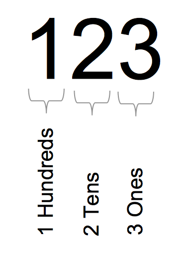
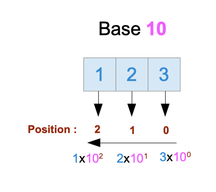
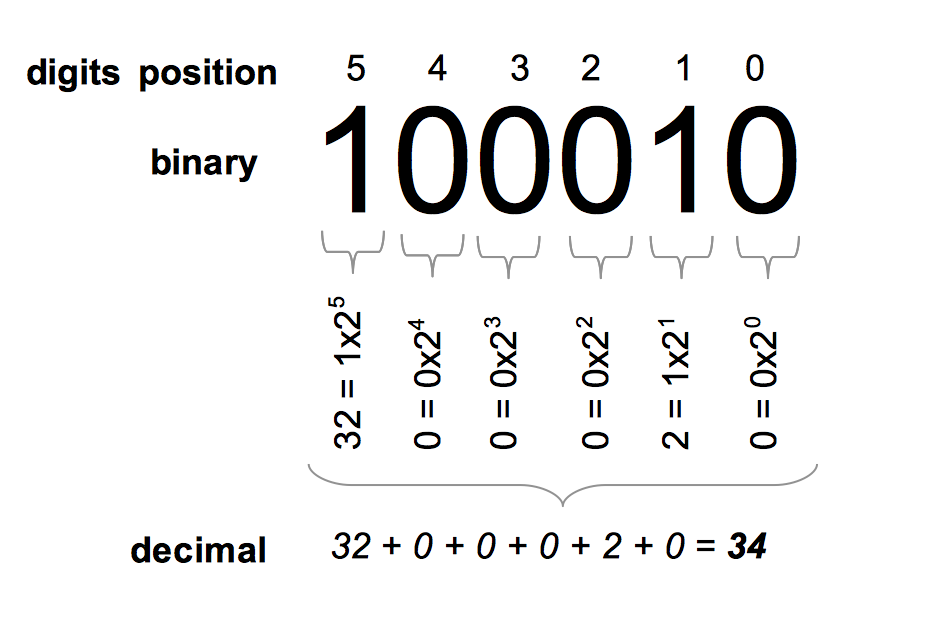
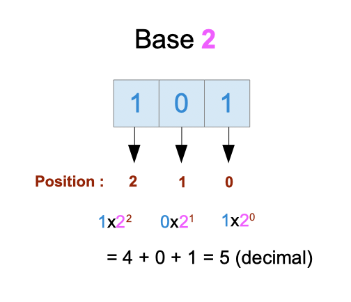
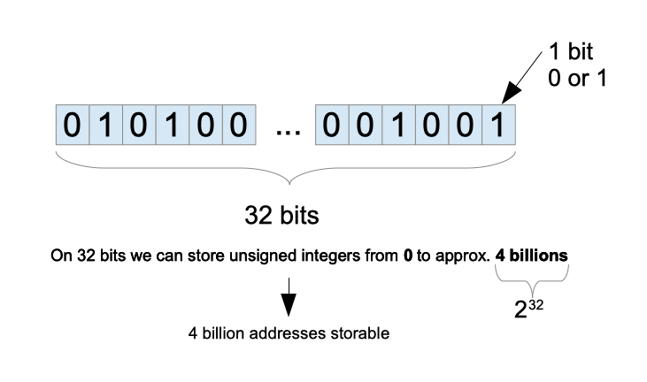
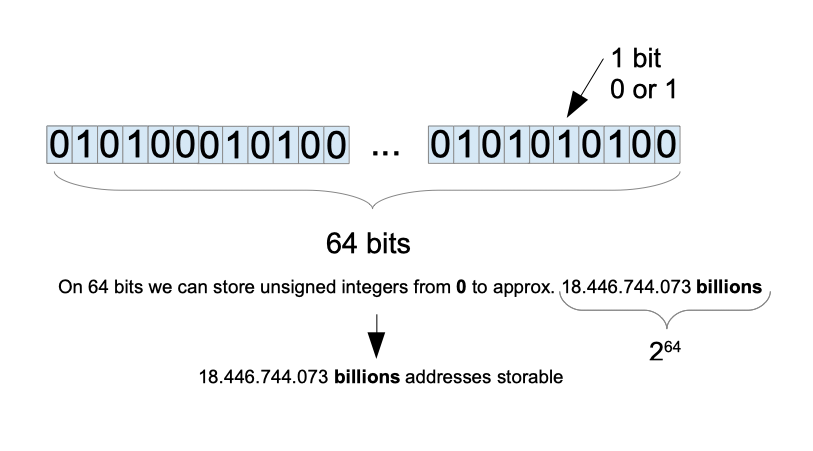

# 第 6 章 - 二进制和十进制

## 1 您将在本章学到什么？

* 十进制和二进制计数系统之间的区别。
* 计算机如何存储数据。
* 32 位和 64 位系统有什么区别？

## 2 涵盖的技术概念

* 二进制（binary）
* 位（bits），字节（bytes）
* 十进制（decimal）
* 编码（encoding），编码器（encoder）
* RAM

## 3 简介：数值、数字和数量

首先，让我们定义一些重要的术语。

* **数值（numeral）**：代表数字的符号或字符组[1](#numeral)。
* **数字（number）**：一个数字代表一个数量，是我们可以计算的东西。
* **数值**是一个**数字**的代表。
* **数值系统（numeration system）**：数值系统是一套规则，使我们能够计算事物和表示数量。

我们每天都在使用十进制表示的数字：10.254 , 125, 2020, 31 ....

但**十进制系统并不是唯一的系统**，也不是一直在使用。

我们可以使用其他计数系统来表示数字。

* 我们以数量 “123”[译1](#译1) 为例
  - 在十进制系统表示为 “123”
    - 数值值为 “123”
  - 在二进制系统中表示为 “1111011”
    - 数值值为 “1111011”
  - 在十六进制系统中表示为 “7B”
    - 数值值为 “7B”
  - 在八进制系统中表示为 “173”
    - 数值值为 “173”

同一个量，相同的意义可以有不同的表现形式。

为什么理解这一点很重要？因为计算机不会使用十进制系统存储数据。在物理层面，信息使用零和一存储。

本章将详细介绍十进制和二进制是如何工作的。

## 4 词源和符号

十进制来自拉丁语 “Decimus”，意思是“第十”。而二进制来自拉丁语 “bini”，意思是“两个在一起”。这两个词的词源为我们提供了有关如何构建这些系统的提示：

* 二进制系统使用两个符号 0 和 1。
* 十进制系统使用十个符号，分别是 0、1、2、3、4、5、6、7、8、9。

使用二进制写入的数据将使用 0 和 1 写入。例如，101010 是使用二进制编码系统编写的。

使用十进制写入的数据将使用 0、1、2、3、4、5、6、7、8、9 写入。例如，使用十进制写入 42。数字 10 可以使用二进制系统或十进制系统进行编码（因此，它不会代表相同的基础数量）。

## 5 十进制系统

我们来看一个用十进制写的数字：123。

这个数字是一百二十三。这个数字由“数字（digits）”组成。第一个数字代表百的数量。第二个数字是十位数。最后一位是个位数。十进制系统是有位置的。这意味着一个数字对数字的贡献取决于该数字在数字中的位置。

让我们更进一步。我们可以用数字十来写数字一百：

$$ 100 = 10 \times 10 $$

我们可以使用十的幂：

$$ 10 \times 10 = 10^2 $$

$ 10^2 $ 等价于 $ 10 \times 10 $。我们将 10 视为基数，而 2 视为指数。当我们读它的时候，我们说它是 10 的 2 幂。根据这种规则，我们可以按如下方式表示：

$$ 10 = 10^1 $$

和

$$ 1 = 10^0 $$

最后一个可能看起来很奇怪。这是一条数学规则：任何数的 0 次幂都等于 1。

有了上面的基础，我们可将数字 123 分解成 10 的幂来计数：

$$ 123 = 1 \times 10^2 + 2 \times 10^1 + 3 \times 10^0 $$

如果您从左到右依次读取 $ 1 \times 10^2 + 2 \times 10^1 + 3 \times 10^0 $，您会发现 10 的幂依次递减。

这个次幂数往往与数字写下时的位置相对应。

* 数字 “1” 在位置 2 处（$ 1 \times 10^2 $）
* 数字 “2” 在位置 1 处（$ 2 \times 10^1 $）
* 数字 “3” 在位置 0 处（$ 3 \times 10^0 $）

我计算位置的方式可能会让您感到惊讶。您预计可能是这样的：

* 数字 “1” 在位置 3
* 数字 “2” 在位置 2
* 数字 “3” 在位置 1

如果您从 1 开始计数，这是完全正确的，但我们从零开始计数。记住这个约定，因为它以后会对您有所帮助！

总之，数值与数字的关系如下。

对于给定的数字：

$$ digit_{2}digit_{1}digit_{0} $$

对应的数字（数量）为：

$$ digit_2 \times 10^2 + digit_1 \times 10^1 + digit_0 \times 10^0 $$

当然，这种关系对多于（或少于）三位数的数字仍然有效！

### 5.1 小数

我们已经看到系统如何处理整数数字；小数呢（带有“小数分隔符”的数字，比如 123.14）

它们同样与 10 的幂有关联。

$$
123.45 = 1 \times 10^{2} + 2 \times 10^{1} + 3 \times 10^{0} + 4 \times \frac{1}{10^{1}} + 5 \times \frac{1}{10^{2}}
$$

这是有道理的，因为：$ \frac{1}{10^{1}} = \frac{1}{10} = 0.1 $，因此 $ 4 \times \frac{1}{10^{1}} = 0.4 $

$
\frac{1}{10^{2}} = \frac{1}{100} = 0.01
$

$ \frac{1}{10^{2}} = \frac{1}{100} = 0.01 $，因此 $ 5 \times \frac{1}{10^{2}} = 0.05 $

## 6 二进制系统

用二进制写成的数字由零和一组成。二进制系统与十进制系统一样，是一种位置数字系统。这意味着每个数字都有一
个取决于其位置的值。它是一个基数为 2 的系统（十进制系统是基数为 10）。

我们来看一个二进制数：

$$ 10_{binary} $$

请注意，我在数字中添加了下标“二进制”，因为这个数字也存在于十进制系统中。十进制数 10 不等于二进制数 10>。它不表示相同的数量。10binary是由两个二进制数字组成的数字。术语二进制数字有一个广泛使用的>缩写：位。我们可以通过使用 2 的幂来得到这个数字的十进制等价物：

$$ 10_{binary} = (1 \times 2^{1} + 0 \times 2^{0})_{decimal} $$

$$ 10_{binary} = (1 \times 2)_{decimal} $$

$$ 10_{binary} = 2_{decimal} $$

二进制数 $ 10_{binary} $ 表示与 $ 2_{decimal} $ 相同的数量。它是两个单元。我们再举一个例子。

$$ 100010_{binary} $$

我们将找到它的十进制表示。我们取每个数字；我们乘以 $ 2^{x} $ 其中 $ x $ 是二进制数中数字的位置（见下图
 2）。

 顺便说一句，我曾经从一位同事那里听到一个关于这个的著名笑话：“世界上有十种人，懂二进制的和不懂二进制的” :)

## 7 存储容量

### 7.1 2 bit 位存储容量

我们可以在两位二进制数中存储的最大十进制数是多少？这是由 2 位数字组成的二进制数列表：

$$ 00_{binary} = (0 \times 2^{1} + 0 \times 2^{0})_{decimal} = 0_{decimal} $$

$$ 01_{binary} = (0 \times 2^{1} + 1 \times 2^{0})_{decimal} = 1_{decimal} $$
$$ 10_{binary} = (1 \times 2^{1} + 0 \times 2^{0})_{decimal} = 2_{decimal} $$
$$ 11_{binary} = (1 \times 2^{1} + 1 \times 2^{0})_{decimal} = 3_{decimal} $$

用两个二进制数字，我们可以存储十进制数字 $ 0_{decimal} $ 到 $ 3_{decimal} $。可存储的最大数为 $ 3_{decimal} $ 十进制。

### 7.2 3 bit 位存储容量

我们可以在三位二进制数字中存储的最大十进制数是多少？这是由 3 位[译2](#译2)数字组成的二进制数列表：

$$ 001_{binary} = (0 \times 2^{2} + 0 \times 2^{1} + 1 \times 2^{0})_{decimal} = 1_{decimal} $$
$$ 010_{binary} = (0 \times 2^{2} + 1 \times 2^{1} + 0 \times 2^{0})_{decimal} = 2_{decimal} $$

### 7.3 8 bit 位存储容量（一个字节）

我们可以存储在八位二进制数字中的最大十进制数是多少？我们可以列出所有可以构建的不同二进制数，但这会很耗时。您是否注意到在前面的部分中最大数量只有一个？当一个二进制数只由 1 组成时，这似乎是合乎逻辑的；它的十进制值将等于 2 的幂之和（从 0 到 n），其中 n 是位数减 1。如果二进制数中只有一个 0 位，则不计算两个对应的幂。

$$ 11111111_{binary} = (1 \times 2^7 + 1 \times 2^6 + 1 \times 2^5 + 1 \times 2^4 + 1 \times 2^3 + 1 \times 2^2 + 1 \times 2^1 + 1 \times 2^0)_{decimal} = 255_{decimal} $$

使用 8 bit 位，我们可以存储 $ 0_{decimal} $ 到 $ 255_{decimal} $ 之间的所有十进制数。8 bit 位称为一个字节。从 $ 0_{decimal} $ 到 $ 255_{decimal} $ 共有 256 个数字。

## 8 如何存储图片、视频等内容？

我们详细介绍了如何将十进制数转换为二进制数以将其存储在内存中。我希望这是明确和令人兴奋的。然而，这还不够。程序操作的东西远比数字多。

我们可以使用以下内容构建程序：

* 图片
* 文本
* 电影
* 3D 模型
* ...

这些对象如何存储在内存中呢？

答案很简单：最后，甚至照片和电影也将使用 0 和 1 存储。我们会将它们转换为二进制。这项工作会交由一个名为**编码器**的专用程序来执行。编码器将特定格式的文件作为输入，并将其转换为目标格式。在我们的例子中，目标是二进制的。

我们不需要编写那些程序；它们都是由 Go 提供的。你需要了解，每一个文件或数据块都是用二进制数字（比特）存储的。

二进制表示对我们来说是隐藏的。

## 9 32 位系统和 64 位系统

### 9.1 程序需要的内存

计算机的处理器负责执行程序。大多数程序需要存储和访问内存。如果您编写一个在屏幕上显示 42 的程序。在幕后，数字 42 需要存储在某个地方。系统还需要从内存中获取它。

这是通过寻址系统完成的。每一位信息都存储在内存单元中的精确位置，而要获取它们，处理器需要有能力获取其完整地址。

请记住，有两种类型的内存：

* 中央存储器：ROM 和 RAM
* 辅助存储器：硬盘、U 盘...

这里我们只考虑中央存储器。

### 9.2 内存地址是一个数字

对于处理器来说，**地址就是一个数字**。内存地址就像邮编地址。它精确地标识了内存空间中的一个点。

处理器将在寄存器上存储地址。寄存器是处理器内部可以保存地址以备后续使用的地方。例如，假设我们有一个进行加法运算的程序。我们的程序定义了一个变量来保存第一个值（如 1.234）和另一个变量来存储第二个值（如 1.290.999）。处理器将在其寄存器中保存这两个地址。当处理器执行我们的程序时，它需要从内存中获取值 1.234 和值 1.290.999。处理器将在其寄存器中保存这两个地址。

### 9.3 可寻址内存：有限的资源

寄存器容量有限；它们可以存储特定大小的地址（以位为单位）。对于 16 位处理器，这些寄存器的最大容量是 16 位。对于 32 位处理器，最大容量为 32 位。相同的推理适用于 64 位。

最大寄存器容量将定义我们可以寻址多少内存。

为什么呢？请记住，我们将地址存储在这些寄存器中，地址是一个数字：

* **32 位系统上**，我们可以存储从 $ 0 $ 到 $ 4.294.967.295\approx2^{32} $ 的数字。
  - 使用 32 位，我们可以存储 40 亿个无符号数，40 亿个地址。
* **64 位系统上**，我们可以存储从 $ 0 $ 到 $ 18.446.744.073.709.551.615\approx 2^{64} $ 的数字。
  - 这使得具有更多的寻址空间。

 32 位 = 40 亿个地址

 64 位 = 18.446.7440.73 亿个地址（很多地址:)）

### 9.4 可能的地址数与 RAM 大小之间的关系

RAM 是由存储单元组成的硬件组件。位存储在单元格中。一般来说，RAM 被认为是可字节寻址的。这意味着系统可以一次获取 8 位数据。

我们已经看到内存地址的大小受寄存器大小的限制。

32 位系统只能处理由 32 位组成的地址。每个位由 0 或 1 组成，这使得有 $ 2^{32}\approx 40 $ 亿种可能性。

* 有 40 亿个地址，我们可以寻址多少字节呢？
  - => 40 亿字节！
  - 我们可以将此数量转换为千兆字节。
    - 1 GB = 10 亿字节
	- 因此，40 亿字节 = 4 GB

对于 32 位系统，系统可以访问 4 GB 的内存。在 32 位系统上安装超过 4 GB 的 RAM 是没有用的。

* 在 64 位系统上，地址的数量要多得多；因此可寻址的内存量更大：理论上有 16 Exabytes（1 Exabyte = 1.073.741.8241.073.741.824 GB）的内存大小。
  - 因此，16 Exabyte 理论上是 64 位计算机上可寻址的最大 RAM 量。

## 10 自测

### 10.1 问题

1. 什么是位（bit）？
2. 什么是字节（bytes）？
3. 什么是编码器？
4. 32 位系统可寻址的最大 RAM 量是多少？
5. $(001)_{binary}$ 的十进制是多少？

### 10.2 答案

1. 什么是位（bit）？
   1. 这是二进制数字的缩写。
   2. 它要么是 0 要么是 1。
2. 什么是字节（bytes）？
   1. 一个字节包含 8 个 bit 位。
3. 什么是编码器？
   1. 编码器以给定格式接收输入并将其转换为另一种形式。
   2. 该过程是可逆的。
4. 32 位系统可寻址的最大 RAM 量是多少？
   1. 4 GB
5. $(001)_{binary}$ 的十进制是多少？
   1. $1_{decimal}$

## 11 关键要点

* 数值表示为数字。
* 每个数字系统都有其表示数字的方式。
  - 100 可以是用二进制和十进制书写的数字。它不代表相同的数字/数量！
* 在物理层面，数据使用二进制数字（0 和 1）存储在内存中。
* 一位（1-bit）是一个二进制数字。
* 一个字节是八位。
* 64 位系统可以寻址的内存远远多于 32 位系统。

* 1：https://www.encyclopedia.com/social-sciences-and-law/economics-business-and-labor/businesses-and-occupations/numeration-systems

* 译1：此处原文为 “one hundred two thousand and three”，实际上应该是 “123”。
* 译2：此外原文为 “2 digits”，根据上下文应该是 “3 digits”。
