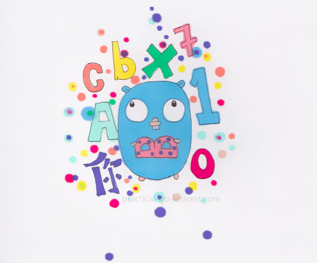
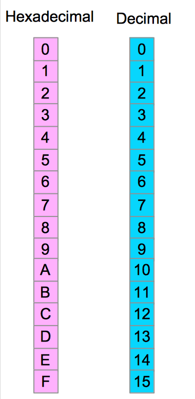
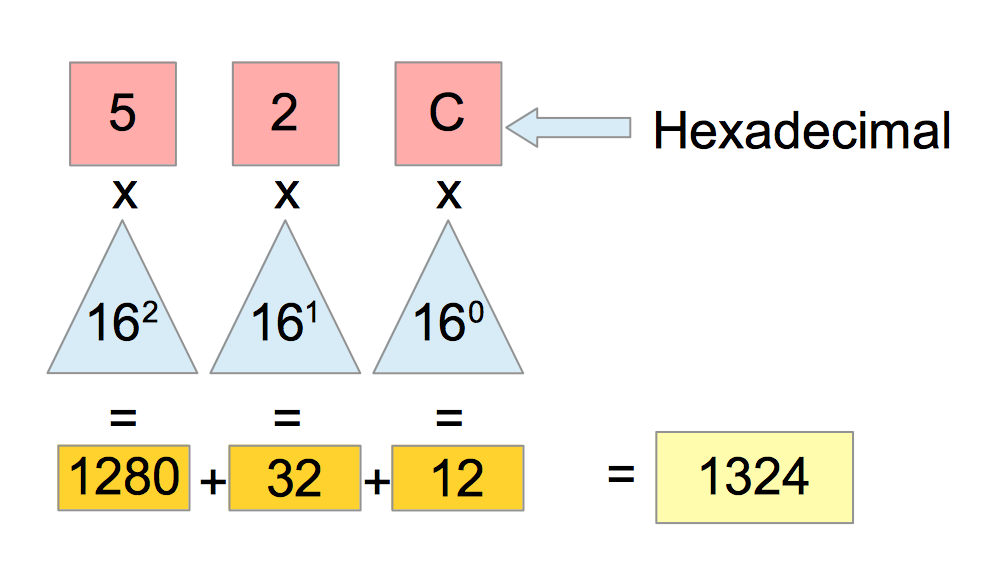
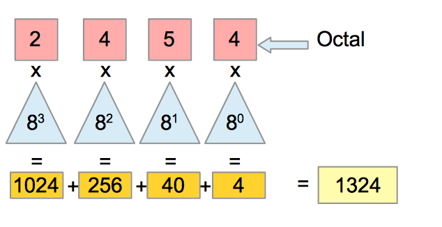
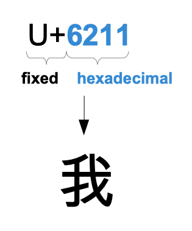
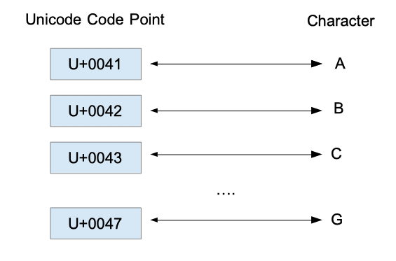
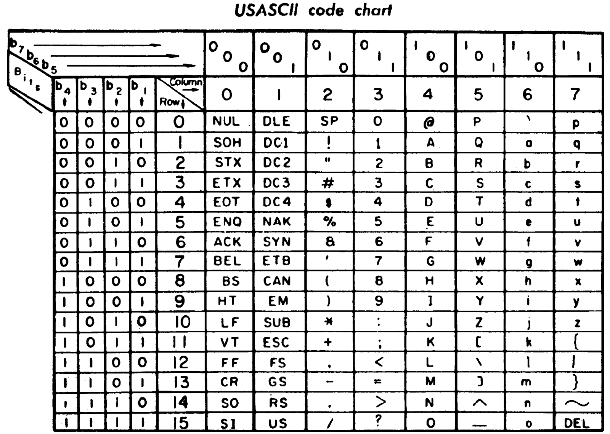
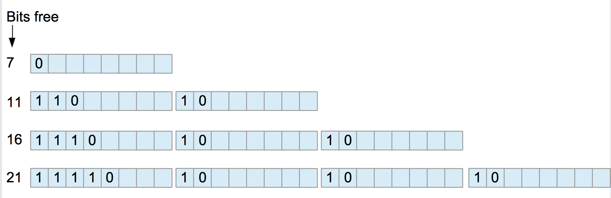

# 第 7 章 - 十六进制、八进制、ASCII、UTF8、Unicode、Runes



## 1 您将在本章学到什么？

* 什么是 Unicode，ASCII 和 UTF-8？
* 字符是如何存储的。
* 什么 rune 类型？

## 2 涵盖的技术概念

* ASCII
* UTF8
* 十六进制（Hexadecimal）
* 八进制（Octal）
* Rune
* 代码点（Code Point）

## 3 简介

在前一章中，我们介绍了十进制和二进制表示法。本章将讨论十六进制和八进制。我们还将讨论 ASCII 和 UTF-8。

## 4 Base 16：十六进制表示

为了表示一个二进制数字，您需要排列许多零和一。这种记法很啰嗦。为了表示十进制的数字 1324，我们需要使用 11 个二进制的字符。这就是为什么我们需要有一个更方便的数字系统来表达大的数字。

十六进制也是一种位置数字系统，它使用 16 个字符来表示一个数字。

* 前缀 Hexa 在拉丁语中的意思是 6
* 十进制来自拉丁词 Decem，意思是 10

这些字符是数字和字母。我们使用从 0 到 9（10 个字符）的数字和从 A 到 F（6 个字符）的字母。

举个例子：10 进制的 1324 相当于 16 进制的 52C。



0 到 9 的数字对应十进制系统中的相同值。字母 A 对应于 10，字母 B 对应于 11 ...等。这是十六进制数字系统的特殊性；我们使用字母来表示数值。

通常，这种特殊性会给我的学生带来困惑和问题，我通常的回答是您必须承认；我们需要更多的字符所以我们拿了字母...



您可以看到我们在这个符号中引入了字母。那是因为从 0 到 9，您有十个字符、十个数字，但是对于基数为 16 的编号系统，我们还需要六个字符。这就是为什么我们采用了字母表的前六个字母。这是历史的选择；可以使用其他字符可以这六个字符，系统将仍然相同。

用于将十六进制数转换为十进制数的方法与前一种类似。我们取最右边的字符，找到它的十进制等价物，然后将其乘以 16 的 0 次方。在我们的示例中，我们有字母 **C**。C 的等价于 12。

要打印数字的十六进制表示，可以使用 fmt 函数：

```go
// hexadecimal-octal-ascii-utf8-unicode-runes/hexa-lower/main.go
package main

import "fmt"

func main() {
	n := 2548
	fmt.Printf("%x", n)
}
```

该程序将输出：9f4（这是十进制数 2548 的十六进制表示）。`"%x"` 是十六进制的**格式化动词（formatting verb）**（字母小写）。

请注意，n 是使用十进制系统表示的数字。

您还可以使用 `"%X"` 打印带有大写字母的十六进制数字：

```go
// hexadecimal-octal-ascii-utf8-unicode-runes/hexa-upper/main.go
package main

import "fmt"

func main() {
	n := 2548
	fmt.Printf("%X", n)
}
```

输出：9F4。

如果要在代码中以十六进制表示数字，请在数字前添加 0x：

```go
// hexadecimal-octal-ascii-utf8-unicode-runes/hex-number/main.go
package main

import "fmt"

func main() {
	n := 2548
	n2 := 0x9F4
	fmt.Printf("%X\n", n)
	fmt.Printf("%x\n", n2)
}
```

输出：

```
9F4
9F4
```

要打印以十进制的数字，您可以使用 `"%d"`：

```go
// /hexadecimal-octal-ascii-utf8-unicode-runes/decimal/main.go
package main

import "fmt"

func main() {
    n2 := 0x9F4
    fmt.Printf("Decimal : %d\n", n2)
}
```

输出：

```
2548
```

## 5 Base 8：八进制表示

我几乎忘记了另一个数字系统！八进制！

它使用基数 8，这意味着八个不同的字符。选择了从 0 到 7 的数字。十进制到八进制的转换和我之前介绍的方法类似。让我们举个例子：



我们从最右边的字符开始，将它乘以 8 的 0 次方，即 1。然后我们取下一个字符：5 乘以 8 的 1 次方，即 8...

八进制系统特别用于表示 Unix 操作系统文件的权限。（查看 [[par:octal-file-write]](https://www.practical-go-lessons.com/chap-7-hexadecimal-octal-ascii-utf8-unicode-runes#par:octal-file-write)）。

与十六进制相同的方式， fmt 包为八进制定义了两个格式化动词：

```go
// /hexadecimal-octal-ascii-utf8-unicode-runes/octal/main.go
package main

import "fmt"

func main() {
	n2 := 0x9F4
	fmt.Printf("Decimal : %d\n", n2)

	// n3 is represented using the octal numeral system
	n3 := 02454
	// alternative : n3 := 0o2454

	// convert in decimal
	fmt.Printf("decimal: %d\n", n3)

	// n4 is represented using the decimal numeral system
	n4 := 1324
	// output n4 (decimal) in octal
	fmt.Printf("octal: %o\n", n4)
	// output n4 (decimal) in octal (with a 0o prefix)
	fmt.Printf("octal with prefix : %O\n", n4)
}
```

输出：

```
Decimal : 2548
decimal: 1324
octal: 2454
octal with prefix : 0o2454
```

* `"%o"` 允许您以八进制打印数字。
* `"%O"` 允许您使用 `0o` 前缀以八进制打印数字。

## 数据表示：位、半字、字节和字

Bit 是 Binary digit 的缩写。例如 1010010110010100101100 由 11 个二进制数字组成，即 11 位。将位组合在一起是很常见的。组存在各种规模：

* 一个半字节由 4 位组成
* 一个字节由 8 位（两个半字节）组成
* 一个字由 16 位（两个字节）组成
* 一个双字由 32 位（两个字）组成
* 一个四字由 $ 16\times4=64 $ 位（四个字）组成

使用 Go，您可以创建一个字节切片。许多常见的标准包函数和方法都将字节切片作为参数。让我们看看如何创建字节切片。

```go
// /hexadecimal-octal-ascii-utf8-unicode-runes/slice-of-byte/main.go
package main

import "fmt"

func main() {
	b := make([]byte, 0)
	b = append(b, 255)
	b = append(b, 10)
	fmt.Println(b)
}
```

在前面的代码片段中，我们创建了一个字节切片（使用内置 make），然后我们将两个数字附加到切片中。

Golang 字节类型是 uint8 的别名。 uint8 意味着我们可以在 8 位（一个字节）的数据上存储无符号（没有任何符号，所以没有负数）整数。最小值为 0（二进制数字 $ 0000000_2 $），最大值是 255（$ 11111111_2 $ 相当于十进制数字 $ 2^7 + 2^6 + 2^5 + 2^4 + 2^3 + 2^2 + 2^1 + 2^0 $）。

这就是为什么我们只能将 0 到 255 之间的数字附加到字节切片上。如果您尝试附加一个大于 255 的数字，您将收到以下错误：

```
dataRepresentation/bytes/main.go:7:15: constant 256 overflows byte
```

要打印数字的二进制表示，您可以使用 `"%b"` 格式化动词：

```go
// /hexadecimal-octal-ascii-utf8-unicode-runes/decimal-binary/main.go
package main

import "fmt"

func main() {
	n2 := 0x9F4
	fmt.Printf("Decimal : %d\n", n2)
	fmt.Printf("Binary : %b\n", n2)
}
```

输出：

```
Decimal : 2548
Binary : 100111110100
```

## 7 其它字符呢？

如果你想存储数字以外的东西怎么办？例如，我们如何存储 Masaoki Shiki 的这个俳句：

```
spring rain:
browsing under an umbrella
at the picture-book store
```

字节类型是否合适？一个字节只不过是一个存储在 8 位上的无符号整数。这个俳句由字母和特殊字符组成。我们有一个 “:” 和一个 “-”，我们还有换行符...我们如何存储这些字符？

我们必须想办法给每个字母甚至特殊字符一个唯一的代码。您可能听说过 UTF-8、ASCII、Unicode？本节将解释它们是什么以及它们是如何工作的。一旦我开始编程（那不是在 Go 中），字符编码是一种晦涩的东西，我觉得它并不有趣。我认为字符编码可能是必不可少的，因为我花了几个晚上的时间来解决可以通过对字符编码的基本理解来解决的问题。

字符编码的历史非常丰富。随着电报的发展，我们需要一种可以在电线上传输的方式来编码消息。最早的尝试之一是摩尔斯电码。它由四个符号组成：短信号、长信号、短空格、长空格（维基百科）。字母表中的每个字母都可以用莫尔斯编码。例如，A 被编码为一个短信号，然后是一个长信号。加号 “+” 被编码为 “short long short long short”。

## 8 词汇

我们需要定义一个通用词汇来理解字符编码：

* **字符（Character）**：这可以用我们的手来写。它传达了一种意义。例如，符号 “+” 是一个字符。这意味着在其他东西上添加一些东西。字符可以是字母、符号或表意文字。
* **字符集（Character set）**： 这是一组不同的字符。您经常会看到或听到缩写 “charset”。
* **码点（Code point）**：字符集中的每个字符作为唯一标识该字符的等效数值。该数值是一个码点。

## 9 字符集与编码

这里有一个您需要知道的字符集：**Unicode**。这是一个标准，列出了当今计算机上使用的生活语言中的绝大多数字符 [[@unicodew3C]](https://www.practical-go-lessons.com/chap-7-hexadecimal-octal-ascii-utf8-unicode-runes#unicodew3C)。

它在版本 11.0 由 137,374 个字符组成 [[@unicodeNorm]](https://www.practical-go-lessons.com/chap-7-hexadecimal-octal-ascii-utf8-unicode-runes#unicodeNorm)。Unicode 就像一个巨大的表格，将一个字符映射到一个码点。例如，字符 “A” 被映射到码点 “0041”。

有了 Unicode，我们就有了基础，我们的字符表，现在下一个挑战是找到一种方法来对这些字符进行编码，将这些码点放入数据字节中。这正是 ASCII 和 UTF-8 所做的。





## 10 ASCII 如何工作？

* ASCII 表示美国信息交换标准代码（**A**merican **S**tandard **C**ode for **I**nformation **I**nterchange）。它是在六十年代发展起来的。目标是找到一种方法来对用于传输消息的字符进行编码。

ASCII 在七个二进制数字上编码字符。另一个二进制数字是奇偶校验位。奇偶校验位用于检测传输错误。加在前 7 位之后，值为 0。如果 1 的个数为奇数，则奇偶校验位为 1；如果数字是偶数，则设置为 0。

一个字节的数据可以存储每个字符（8 位见 [[sec:Data-representation-bits,]](https://www.practical-go-lessons.com/chap-7-hexadecimal-octal-ascii-utf8-unicode-runes#sec:Data-representation-bits)。仅用 7 位可以创建多少个整数？使用一个比特，我们可以编码两个值，0 和 1，使用 2 个比特，我们可以编码四个不同的值。当您添加一位时，您可以将可以编码的值的数量乘以 2。使用 7 位，您可以编码 128 个整数。更一般地，可以用 n 个二进制数字编码的无符号整数的数量是 2 的 n 次幂。

| bit 位数量 | 值的数量 |
|------------|----------|
| 1          | 2        |
| 2          | 4        |
| 3          | 8        |
| 4          | 16       |
| 5          | 32       |
| 6          | 64       |
| 7          | 128      |

编码的二进制数字和可能值的数量。

ASCII 允许您对 128 个不同的字符进行编码。对于每个字符，我们都有一个特定的码点。无符号整数值表示码点。



在上图中，您可以看到 USASCII 代码图表。此表允许您将字节转换为字符。例如，字母 B 相当于 1000010（二进制）（第 4 列，第 2 行）

## UTF-8 如何工作？

* UTF-8 表示通用字符集转换格式 1 - 8 位。它是由两个人发明的，他们也是 Go 的创造者：Rob Pike 和 Ken Thompson！这种编码的设计非常巧妙。我将尝试简要解释一下。

UTF-8 是一种可变宽度（**variable width**）的编码系统。这意味着字符使用一到四个字节进行编码（一个字节代表八个二进制数字）。



在上图中您可以看到 UTF-8 的编码规则。一个字符可以编码为 1 到 4 个字节。

可以仅使用一个字节进行编码的码点是从 U+0000 到 U+007F（包括在内）。该范围由 128 个字符组成。（从0到127，一共有128个数字）

但是需要编码更多的字符！这就是为什么 UTF-8 的创建者有向系统添加字节的想法的原因。第一个附加字节以 1 和 0 开头；那些是固定的。它向解码器发出信号，我们现在使用 2 个字节来编码我们的字符，我们只需添加位 “110”。它对 UTF-8 解码器说：“小心；我们是 2 个字节！”。

如果我们使用 2 个字节，我们有 11 位空闲（8 * 2 - 5（固定位）= 11）。我们可以对 U+0080 到 U+07FF 闭区间的 Unicode 码点的字符进行编码。那代表多少个字符呢？

* 十六进制 0080 = 十进制 128
* 十六进制 07FF = 十进制 2047
* 从 0080 到 07FF 有 2047 - 128 + 1 = 1920

你可能会问为什么我们要在计数上加一...这是因为字符是代码点 0 开始索引的。

如果使用 3 个字节，则第一个字节将固定以 **1110** 开始。这将向解码器发出信号，该字符是使用 3 个字节编码的。换句话说，下一个字符将在第三个字节之后开始。两个附加字节以 10 开头。使用三个编码字节，您有 16 位空闲（8 * 3 - 8（固定位）= 16）。您可以将字符从 U+0800 编码到 U+FFFF。

如果您已经了解了 3 个字节是如何工作的，那么了解系统如何使用 4 个字节应该没有问题。在我们的第一个字节中，我们将前五个位固定为 **11110**。然后我们有三个额外的字节。如果我们从总位数中减去固定位，我们就有 21 位可用。这意味着我们可以将码点从 U+10000 编码到 U+10FFFF。

## 12 字符串
