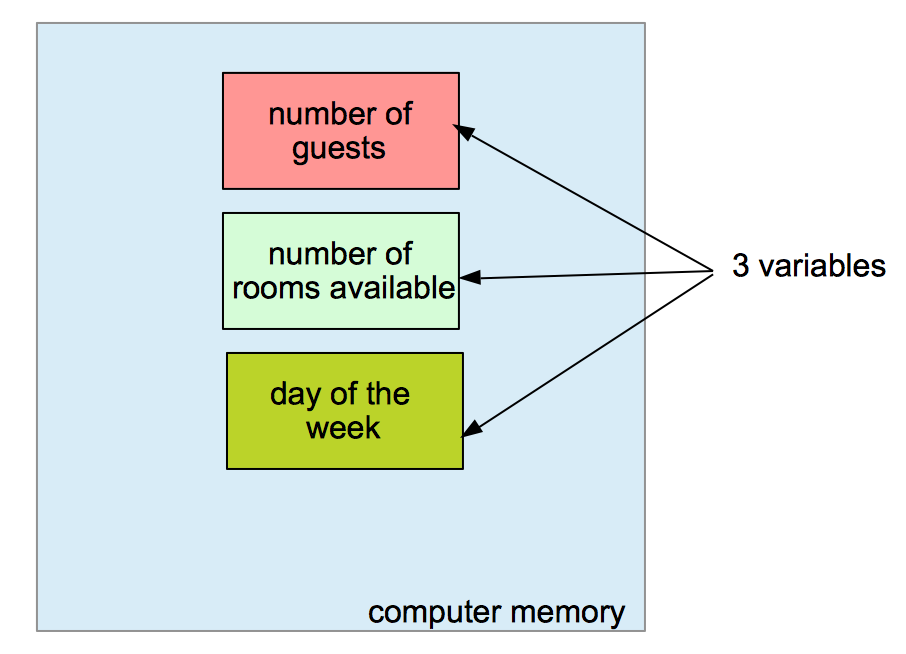

# 第 8 章 - 变量、常量和基本类型

## 1 您将在本章学到什么？

* 什么是变量？为什么我们需要它？
* 什么是类型？
* 如何创建变量？
* 如何给变量赋值？
* 如何使用变量？
* 什么是常量？常量与变量有什么区别？
* 如何定义常量？
* 如何使用常量？

## 2 涵盖的技术概念

* 变量
* 常量
* 类型
* 无类型常量

## 3 变量是内存中的一个空间

变量是计算机内存中可以包含可变数据的空间。“变量”一词来自拉丁语 “variabilis”，意思是“可变的”。在程序中，我们可以创建允许您存储信息以备后用的变量。

例如，我们想要跟踪酒店的客人数量。客人的数量会有所不同。我们可以创建一个变量来存储这些信息（参见下图）。

## 4 变量存储在哪里？

我们之前谈到了 ROM、RAM 和辅助存储器。Go 变量存储在哪里？答案很简短；您无法选择变量的存储位置。这是编译器的责任，不是你的！

## 5 变量标识符（名称）

在大多数编程语言（包括 Go 语言）中，当我们创建一个变量时，我们将它与一个标识符（**identifier**）相关联。标识符是变量的“名称”。为变量提供标识符允许我们在程序中快速使用它们。标识符由字母和数字组成。变量的标识符将在程序内部用于指定存储在其中的值。标识符必须简短且具有描述性。

要创建标识符，程序员可以发挥创造力。但他们必须遵循这些简单的规则：

1. 标识符由下面两部分组成
   1. Unicode 字母
      1. 例如：A, a, B, b, Ô ...
   2. Unicode 数字
      1. 例如：0,9,3, ...
2. 标识符必须以字母或下划线字符开头。“_”
3. 某些标识符无法使用，因为它们是由语言**保留**的
   1. **保留的关键字**：break, default, func, interface, select, case, defer, go, map, struct, chan, else, goto, package, switch, const, fallthrough, if, range, type, continue, for, import, return, var

`numberOfGuests` 是有效的变量标识符，`113Guests` 是**无效**的变量标识符，因为它由数字开始。

## 6 基本类型

我们可以将信息存储到变量中。术语信息含糊不清；我们必须更精确。我们是否需要存储数字（1、2000、3）、浮点数（2.45665）、文本（“Room 112 non-Smoking”）？一个变量有一组我们可以分配给它的允许值。这个集合是变量的**类型**。类型也有类型名。

Go 语言预先声明了一组基本类型，您可以立即在程序中使用它们。您还可以定义您的类型（我们稍后会看到）。目前，我们将只关注最常用的类型：

* 字符串：
  * 类型名：`string`
  * 例如：`“management office”, “room 265”,...`
* 无符号整数：
  * 类型名：`uint, uint8, uint16, uint32, uint64`
  * 例如：`2445, 676, 0, 1,...`
* 整型（有符号）：
  * 类型名：`int, int8, int16, int32, int64`
  * 例如：`-1245, 65, 78,...`
* 布尔类型：
  * 类型名：`bool`
  * 例如：`true, false`
* 浮点数：
  * 类型名：`float32, float64`
  * 例如：`12.67`

### 6.1 关于数字 8、16、32 和 64

您可能已经注意到我们有五种整数：`int, int8, int16, int32, int64`。无符号整数也是如此。我们有 `uint, uint8, uint16, uint32, uint64`。浮点数的选择更加有限：我们可以使用 `float32` 或 `float64`。

如果要存储没有符号的数字，可以使用无符号整数类型。这些类型有 5 种选择：

* uint8
* uint16
* uint32
* uint64
* uint

除了最后一个，每个都附有一个数字。该数字对应于分配用于存储它的内存位数。

如果你读过第一部分，你就会知道：

* 使用 8 位内存，我们可以存储 $0$ 到 $2^7 + 2^6 + ... + 2^0 = 255$ 之间的数字。
* 使用 16 位内存（2 字节），我们可以存储 $0$ 到 $2^15 + 2^14 + ... + 2^0 = 65.535$ 之间的数字。
* 使用 32 位内存（4 字节），我们可以存储 $0$ 到 $2^31 + 2^30 + ... + 2^0 = 4.294.967.295$ 之间的数字。
* 使用 64 位内存（8 字节），我们可以存储 $0$ 到 $2^63 + 2^62 + ... + 2^0 = 18.446.744.073.709.551.615$ 之间的数字。

可以注意到 64 位的最大十进制值非常大。请记住！如果您需要存储不超过 255 的值，请使用 `uint8` 而不是 `uint64`。否则，您将浪费存储空间（因为您只会使用分配在内存中的 64 位中的 8 位！）

最后一种类型是 `uint`。如果您在程序中使用此类型，则为无符号整数分配的内存**至少**为 32 位。这将取决于将运行该程序的系统。如果是 32 位系统，则相当于 `uint32`。如果系统是 64 位，那么 `uint` 的存储容量将与 `uint64` 的存储容量相同。（为了更好地理解 32 位和 64 位的区别，可以看一下前面的章节。）
